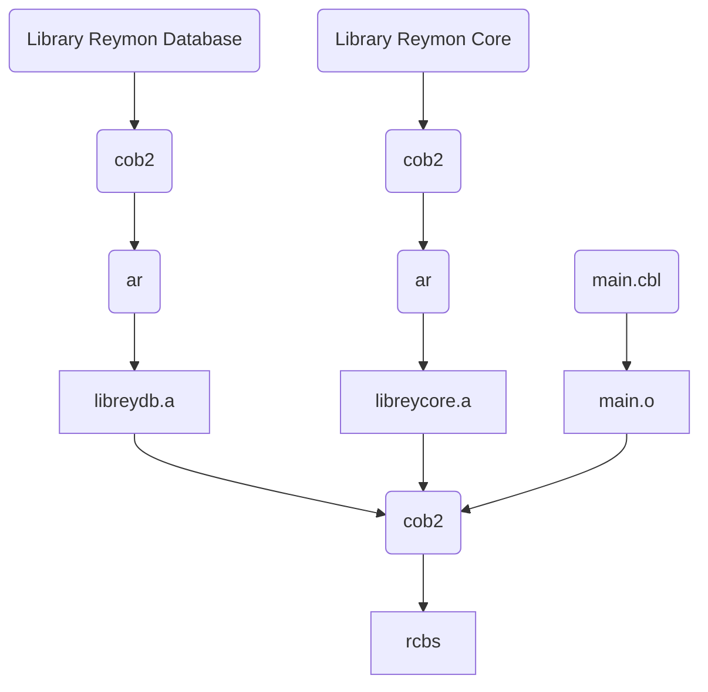
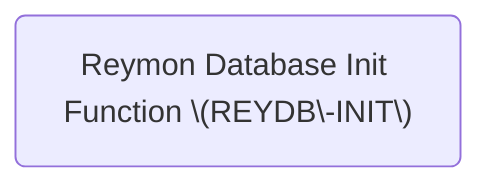

# Reymon Conceptual Banking System (RCBS)

## Purpose

This software was created for my CV and to demonstrate that I know Cobol.
Secondarily, I am taking advantage of this opportunity so that anyone
interested in learning Cobol can study the code without any inconvenience.

## Compilation Flow

## Operation of the Reymon database library (libreydb)

